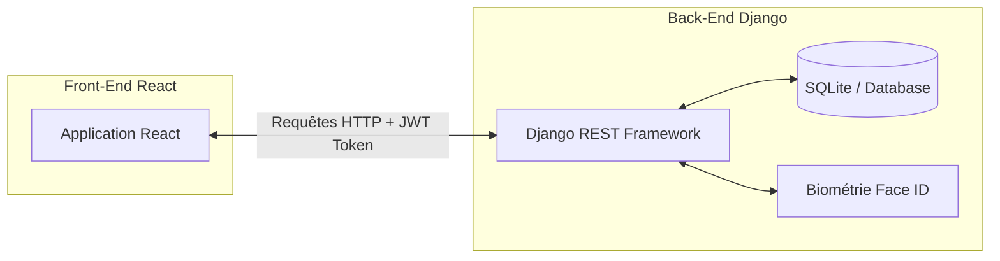
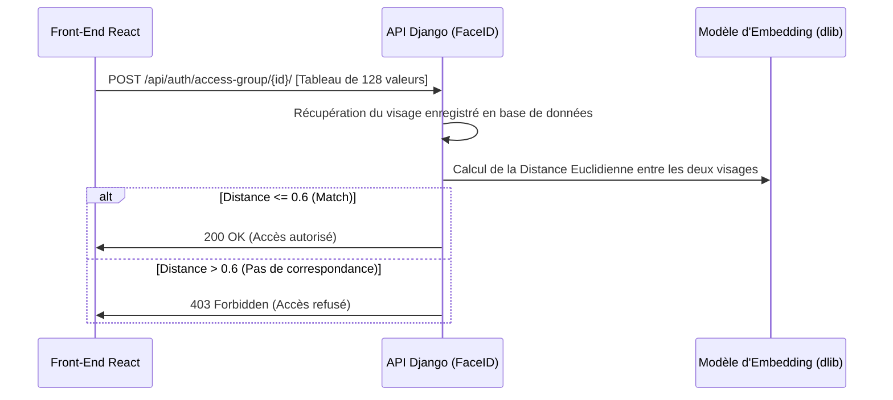

# 📘 Documentation Technique & Architecture du Projet LMS SFE

Ce document présente l'architecture, la structure des fichiers, les choix technologiques et la logique métier de la plateforme LMS (Learning Management System) développée dans le cadre de ce projet de fin d'études. Il a été conçu pour permettre à tout développeur de comprendre et de reprendre facilement le développement du projet.

---

## 🚀 1. Introduction & Architecture Globale

La plateforme LMS est une application web découplée moderne conçue pour la gestion et le suivi des formations professionnelles au sein d'une entreprise. 

Elle repose sur une architecture **API-first** divisée en deux parties :
*   **Back-end** : API REST développée en **Django REST Framework (DRF)**.
*   **Front-end** : Application cliente dynamique développée en **React** (avec build tool moderne).



### 🛠️ Choix technologiques majeurs
*   **Langages** : Python 3.x, JavaScript (ES6+), HTML5, CSS3.
*   **Framework Back-end** : Django & Django REST Framework (DRF).
*   **Base de Données** : SQLite (environnement de développement).
*   **Sécurité** : JWT (JSON Web Tokens) via `djangorestframework-simplejwt`.
*   **Biométrie** : `dlib` & `face_recognition` (modèle de Deep Learning pré-entraîné).
*   **Documentation API** : `drf-spectacular` (norme OpenAPI 3 / Swagger).
*   **Framework Front-end** : React (avec React Router DOM pour le routage de l'application).

---

## 🗂️ 2. Arborescence Détaillée du Projet

Voici la structure organisée des répertoires du projet, avec l'explication du rôle de chaque dossier clé.

### 🐍 Back-end (Django)
```text
ProjetSFE/
├── manage.py                   # Script d'administration principal de Django
├── config/                     # Répertoire de configuration du projet Django
│   ├── settings.py             # Paramètres système, applications activées, config JWT/Swagger
│   ├── urls.py                 # Routage global des requêtes HTTP (liens vers les apps)
│   └── wsgi.py / asgi.py       # Points d'entrée pour les serveurs de production
├── apps/                       # Répertoire contenant les modules métier (Django Apps)
│   ├── authentication/         # Module de gestion des comptes et de la biométrie
│   │   ├── models.py           # Définition du modèle CustomUser et FaceAccessLog
│   │   ├── views.py            # Contrôleurs API (Login, Inscription, Face ID...)
│   │   ├── serializers.py      # Traduction des objets Python/Modèles en JSON
│   │   ├── permissions.py      # Classes de restriction d'accès (IsTL, IsConsultant...)
│   │   └── urls.py             # Routes d'authentification (/api/auth/...)
│   └── courses/                # Module de gestion des formations et du suivi
│       ├── models.py           # Modèles Course, Chapter, Content, Group, Progress, Package
│       ├── views.py            # API de gestion des cours, chapitres, exclusions et stats
│       ├── serializers.py      # Serializers des cours, chapitres, contenus et statistiques
│       └── urls.py             # Routes d'apprentissage (/api/courses/...)
└── media/                      # Fichiers téléversés par les utilisateurs (PDF, vidéos, images)
```

### ⚛️ Front-end (React)
```text
frontend/
├── package.json                # Fichier de dépendances Node.js et scripts de build
├── public/                     # Fichiers statiques publics (index.html, logos)
└── src/                        # Code source React principal
    ├── App.js                  # Routage et point d'entrée de l'application cliente
    ├── index.js                # Rendu de l'arbre DOM React
    ├── api/                    # Configuration du client HTTP Axios
    │   └── axios.js            # Instance Axios avec injecteur automatique de token JWT Bearer
    ├── auth/                   # Contextes et hooks de sécurité utilisateur
    │   ├── AuthContext.js      # Gestion globale de l'état connecté/déconnecté
    │   └── PrivateRoute.js     # Routeur de garde protégeant les pages selon le rôle
    ├── components/             # Composants d'interface utilisateur partagés (Navbar, Layouts)
    └── pages/                  # Pages principales de l'application
        ├── AuthPage.jsx        # Écran de connexion et d'inscription
        ├── ConsultantDashboard.jsx # Accueil et résumé du parcours apprenant
        ├── CoursesPage.jsx     # Catalogue de formation public
        ├── ConsultantGroupe.jsx # Accès aux groupes privés et packages assignés
        ├── ConsultantStatistique.jsx # Graphiques et analyses personnelles de progression
        ├── ConsultantHelp.jsx  # Centre d'aide et de documentation utilisateur
        ├── ConsultantProfile.jsx # Informations et enregistrement biométrique
        ├── TLDashboard.jsx     # Vue superviseur (statistiques globales et gestion)
        └── TLCourses.jsx       # Création et organisation des formations par le Team Leader
```

---

## 🔐 3. Authentification & Sécurité

### 🔑 Système JWT (JSON Web Tokens)
Toutes les requêtes vers des endpoints protégés utilisent des tokens JWT.
1. Le client envoie l'email et le mot de passe via `/api/auth/login/`.
2. Le serveur valide et retourne deux tokens :
    *   **Access Token** (courte durée) : Injecté dans le Header HTTP `Authorization: Bearer <token>` de chaque requête API.
    *   **Refresh Token** (longue durée) : Permet de renouveler l'Access Token expiré sans obliger l'utilisateur à se reconnecter.

### 👥 Gestion des Rôles (RBAC)
Le modèle d'utilisateur `CustomUser` intègre un champ `role` prenant l'une de ces trois valeurs :
*   `admin` (Administrateur) : Accès complet au Django Admin, gestion globale des comptes.
*   `tl` (Team Leader / Superviseur) : Création et gestion des cours, chapitres, contenus, packages, création des groupes et consultation des statistiques de progression de son équipe.
*   `consultant` (Apprenant) : Consultation de son catalogue de cours, validation de sa progression, accès à ses groupes.

---

## 🤳 4. Reconnaissance Faciale Biométrique (Face ID)

L'une des fonctionnalités phares de ce projet est la restriction d'accès aux groupes de formation confidentiels par biométrie faciale.



### 🧠 Logique mathématique & traitement
1. **Enregistrement (`save-face/`)** : Le front-end extrait un vecteur de signature faciale composé de **128 nombres décimaux** (généré par les modèles de réseaux de neurones résiduels de `dlib` après alignement de la photo prise par la webcam) et le transmet au back-end qui le stocke en base de données.
2. **Comparaison & Vérification (`access-group/`)** : Lors d'une demande d'accès au groupe confidentiel, le client renvoie un nouveau vecteur du visage actuel. Le backend calcule la **distance euclidienne** entre les deux vecteurs :
    $$\text{Distance} = \sqrt{\sum_{i=1}^{128} (x_i - y_i)^2}$$
3. **Seuil de tolérance** : Si la distance obtenue est inférieure ou égale à **0.6**, le système valide qu'il s'agit de la même personne et accorde l'accès. Sinon, il rejette la demande pour protéger le groupe de toute tentative d'usurpation d'identité.

---

## 📚 5. Modélisation de Données & Logique Métier

### 📖 Ordonnancement des Chapitres et Contenus
Pour structurer un cours, les modèles `Chapter` et `Content` intègrent un champ `order` (de type entier).
Lors de la création d'un chapitre dans un cours, le système détermine automatiquement son ordre de tri :
$$\text{Nouvel Ordre} = \text{Ordre Maximum Actuel} + 1$$
Une API dédiée `/api/courses/chapters/reorder/` permet au Team Leader de réorganiser dynamiquement l'ordre de tous les chapitres à sa convenance depuis l'interface (Drag & Drop).

### ⚙️ Logique d'Exclusions de Package (Personnalisation Avancée)
Cette fonctionnalité permet au Team Leader d'assigner un package de cours à un groupe, tout en filtrant le contenu selon le profil ou les acquis des membres :
*   **Modèle `PackageCourseExclusion`** : Enregistre les relations d'exclusion personnalisées.
*   **Fonctionnement** : Si le Team Leader exclut le chapitre A d'un cours pour le package Y, la requête API de récupération de cours pour le consultant (`/api/courses/browse/{id}/?package_id=Y`) filtrera automatiquement le jeu de résultats pour exclure le chapitre A de l'affichage.

---

## 📊 6. Suivi des Progrès & Statistiques

Le suivi de progression est calculé dynamiquement grâce aux interactions du consultant avec la plateforme.

*   **`ContentProgress`** : Marque un contenu individuel (PDF, Vidéo, Lien) comme complété par le consultant connecté.
*   **`ChapterProgress`** : Marque un chapitre entier comme terminé lorsque tous ses composants ont été visionnés.
*   **Calcul du taux de progression par cours** :
    $$\text{Progression} = \left( \frac{\text{Nombre de Chapitres Complétés}}{\text{Nombre Total de Chapitres dans le Cours}} \right) \times 100$$
    Ces taux sont compilés en temps réel pour alimenter les indicateurs visuels du consultant et la matrice d'avancement globale visible sur le dashboard du Team Leader.

---

## 🛠️ 7. Guide d'Onboarding pour Développeur

Pour exécuter et reprendre le développement du projet localement, suivez ce guide étape par étape.

### 🖥️ Prérequis système
*   Python 3.10 ou version supérieure installé.
*   Node.js (LTS version) et npm installés.
*   *Facultatif* : Un IDE comme VS Code.

### ⚡ Démarrage Rapide du Back-end
1. Placez-vous à la racine du projet :
   ```bash
   cd ProjetSFE
   ```
2. Créez un environnement virtuel Python :
   ```bash
   python -m venv venv
   ```
3. Activez l'environnement virtuel :
   *   Sur Windows (Powershell) :
       ```powershell
       .\venv\Scripts\Activate.ps1
       ```
   *   Sur macOS/Linux :
       ```bash
       source venv/bin/activate
       ```
4. Installez toutes les dépendances requises :
   ```bash
   pip install -r requirements.txt
   ```
5. Appliquez les migrations de la base de données :
   ```bash
   python manage.py migrate
   ```
6. Lancez le serveur de développement :
   ```bash
   python manage.py runserver
   ```
   Le serveur sera disponible sur `http://localhost:8000`. Vous pouvez consulter le Swagger interactif à l'adresse `http://localhost:8000/swagger/`.

### ⚛️ Démarrage Rapide du Front-end
1. Dans un autre terminal, placez-vous dans le répertoire du client :
   ```bash
   cd ProjetSFE/frontend
   ```
2. Installez les packages Node :
   ```bash
   npm install
   ```
3. Lancez le serveur de développement local :
   ```bash
   npm start
   ```
   L'application s'ouvrira automatiquement sur `http://localhost:3000`.

---

*Ce document a été élaboré avec le plus grand soin pour refléter l'état exact et les performances optimales de l'application. Si vous rencontrez un problème lors de l'installation, veuillez vérifier les logs d'erreurs générés ou soumettre un ticket d'assistance.*
